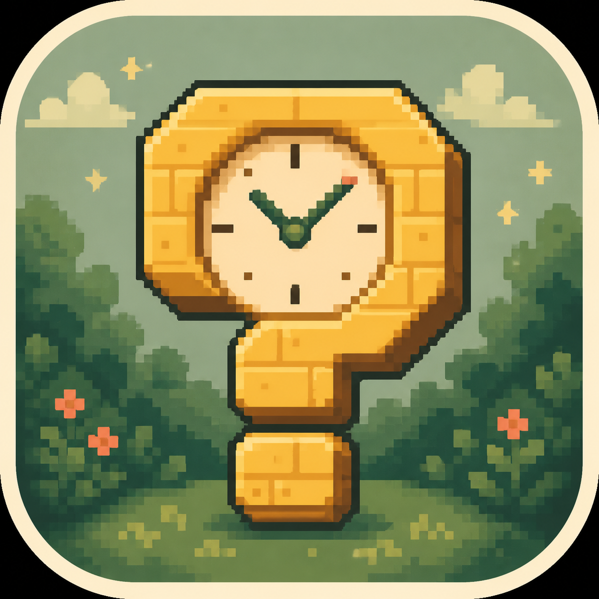
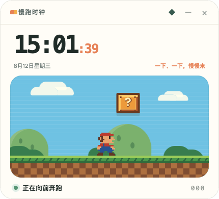

<div align="center">
  

  # 慢跑时钟

  **一个会奔跑、会顶砖、也会陪你慢下来的桌面时钟。**

  [](https://www.electronjs.org/)
  [](#开始使用)
  [](renderer.js)
  [](https://github.com/wangzhongren/slow-run-clock/actions/workflows/build.yml)
</div>

<p align="center">
  
</p>

---

## 为什么做它

焦虑的时候，复杂的功能往往只会带来更多负担。

**慢跑时钟**把时间、像素游戏和可预期的节奏放在一个小小的桌面悬浮窗里：角色一直向前奔跑，每 5 秒跳起顶一次问号砖，获得一枚金币。

没有任务、没有失败、没有需要追赶的进度。只有稳定的时间，和一个反复发生的小小奖励。

## 特点

- **实时桌面时钟** — 显示当前时、分、秒与日期
- **5 秒舒缓节奏** — 起跳与系统时间对齐，不会逐渐漂移
- **像素横版场景** — 角色跑步，云层、远山、灌木和草地分层滚动
- **游戏式奖励** — 问号砖被顶后变为已使用状态，并弹出金币
- **轻量音效** — 撞砖与金币都有简短、低干扰的像素提示音
- **悬浮窗口** — 无边框、磨砂半透明，支持保持置顶
- **无网络依赖** — 时钟、动画和音效均在本地运行

## 开始使用

### 从 GitHub Actions 下载

1. 打开 [Build desktop apps](https://github.com/wangzhongren/slow-run-clock/actions/workflows/build.yml)
2. 选择 **Run workflow**
3. 等待 macOS 和 Windows 两个任务完成
4. 在该次运行页面底部的 **Artifacts** 下载：
   - `slow-run-clock-macos-arm64`
   - `slow-run-clock-windows-x64`

打上 `v*` 格式的 Git 标签（例如 `v1.0.0`）时，也会自动执行两个平台的构建。Actions 产物保留 30 天。

### 环境要求

- macOS 或 Windows 10/11
- Node.js 22 或更高版本
- npm

### 本地运行

```bash
git clone git@github.com:wangzhongren/slow-run-clock.git
cd slow-run-clock
npm install
npm start
```

### 生成 macOS 应用

```bash
npm run pack
```

生成的 `慢跑时钟.app` 位于 `dist/mac-arm64/` 中。

如果需要生成 DMG 安装包：

```bash
npm run dist
```

> 当前本地构建未使用 Apple Developer ID 签名。首次打开时，macOS 可能需要在 Finder 中右键应用并选择“打开”。

### 生成 Windows 安装包

建议在 Windows 10/11 的 PowerShell 中执行：

```powershell
git clone https://github.com/wangzhongren/slow-run-clock.git
cd slow-run-clock
npm install
npm run dist:win
```

打包完成后，可在 `dist/` 目录中找到：

```text
慢跑时钟-Setup-1.0.0.exe
```

该安装程序支持选择安装目录，并会创建桌面与开始菜单快捷方式。

> Windows 安装包目前未使用代码签名证书。首次运行时，Microsoft Defender SmartScreen 可能会显示提示；可选择“更多信息”后点击“仍要运行”。

#### 在 macOS/Linux 上打包 Windows 版

Electron Builder 支持部分跨平台构建，但 NSIS 打包可能需要 Wine 等额外环境。为了获得稳定且可复现的 Windows 安装包，优先在 Windows 主机或 Windows CI 环境中执行 `npm run dist:win`。

## 项目结构

```text
slow-run-clock/
├── main.cjs          # Electron 主进程与悬浮窗口
├── preload.cjs       # 安全的窗口操作接口
├── index.html        # 时钟与像素场景结构
├── styles.css        # 界面、滚动场景与动画
├── renderer.js       # 时间同步、角色、砖块与音效
└── build/app-icon.png # 应用图标源文件
```

## 设计原则

1. **可预期** — 固定的 5 秒节奏，不用随机反馈制造紧张感。
2. **低干扰** — 界面不展示任务、分数排名或连续签到。
3. **有用，也有趣** — 首先是一枚可用的时钟，然后才是一个小小的像素世界。

---

<div align="center">
  <sub>跑一会儿，顶一下，然后继续向前。</sub>
</div>
